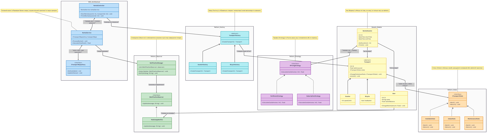

# UML-діаграма

# Посилання
https://mermaid.ai/app/projects/dab3a6f0-12e8-40e2-9baf-4fb870e16267/diagrams/bca356db-0a32-4dc5-b2e7-6a7bad1c16eb/version/v0.1/edit

# Код Сайта Mermaid
    classDiagram

    namespace MVC_Architecture {
        class RentalController {
            -RentalService rentalService
            +StartRental(userId: int, transportId: int) void
            +FinishRental(sessionId: int) void
        }
        class RentalService {
            -ITransportRepository transportRepo
            +ProcessRental() void
            +CalculateTotalCost() float
        }
        class ITransportRepository {
            <<interface>>
            +GetAvailable() List
            +UpdateStatus() void
        }
    }
    note for RentalService "Головний мозок:\nПеревіряє баланс юзера,\nшукає вільний транспорт\nі керує орендою."
    
    style RentalController fill:#bbdefb,stroke:#1976d2,stroke-width:2px
    style RentalService fill:#bbdefb,stroke:#1976d2,stroke-width:2px
    style ITransportRepository fill:#bbdefb,stroke:#1976d2,stroke-width:2px

    namespace Pattern_Observer {
        class INotificationObserver {
            <<interface>>
            +Update(message: String) void
        }
        class MobileAppNotifier {
            +Update(message: String) void
        }
        class NotificationManager {
            -List~INotificationObserver~ observers
            +Subscribe(obs: INotificationObserver) void
            +NotifyAll(msg: String) void
        }
    }
    note for NotificationManager "Сповіщення (Observer):\nАвтоматично розсилає пуші\nпро завершення поїздки."

    style INotificationObserver fill:#c8e6c9,stroke:#388e3c,stroke-width:2px
    style MobileAppNotifier fill:#c8e6c9,stroke:#388e3c,stroke-width:2px
    style NotificationManager fill:#c8e6c9,stroke:#388e3c,stroke-width:2px

    namespace Pattern_Strategy {
        class IPricingStrategy {
            <<interface>>
            +CalculateCost(minutes: int) float
        }
        class PerMinuteStrategy {
            +CalculateCost(minutes: int) float
        }
        class SubscriptionStrategy {
            +CalculateCost(minutes: int) float
        }
    }
    note for IPricingStrategy "Тарифи (Strategy):\nГнучко рахує ціну:\nпохвилинно або по підписці."

    style IPricingStrategy fill:#e1bee7,stroke:#8e24aa,stroke-width:2px
    style PerMinuteStrategy fill:#e1bee7,stroke:#8e24aa,stroke-width:2px
    style SubscriptionStrategy fill:#e1bee7,stroke:#8e24aa,stroke-width:2px

    namespace Pattern_State {
        class ITransportState {
            <<interface>>
            +Rent() void
            +Return() void
        }
        class AvailableState {
            +Rent() void
            +Return() void
        }
        class InUseState {
            +Rent() void
            +Return() void
        }
        class MaintenanceState {
            +Rent() void
            +Return() void
        }
    }
    note for ITransportState "Статус (State):\nБлокує спробу орендувати\nзламаний або зайнятий транспорт."

    style ITransportState fill:#ffe0b2,stroke:#f57c00,stroke-width:2px
    style AvailableState fill:#ffe0b2,stroke:#f57c00,stroke-width:2px
    style InUseState fill:#ffe0b2,stroke:#f57c00,stroke-width:2px
    style MaintenanceState fill:#ffe0b2,stroke:#f57c00,stroke-width:2px

    namespace Pattern_Factory {
        class TransportFactory {
            <<abstract>>
            +CreateTransport() Transport
        }
        class ScooterFactory {
            +CreateTransport() Transport
        }
        class BicycleFactory {
            +CreateTransport() Transport
        }
    }
    note for TransportFactory "Завод (Factory):\nПравильно створює і налаштовує\nнові велосипеди та самокати."

    style TransportFactory fill:#b2ebf2,stroke:#0097a7,stroke-width:2px
    style ScooterFactory fill:#b2ebf2,stroke:#0097a7,stroke-width:2px
    style BicycleFactory fill:#b2ebf2,stroke:#0097a7,stroke-width:2px

    namespace Domain_Models {
        class Transport {
            <<abstract>>
            -int id
            -float batteryLevel
            -ITransportState state
            +ChangeState(newState: ITransportState) void
            +Unlock() void
        }
        class Scooter {
            -int speedLimit
        }
        class Bicycle {
            -bool hasBasket
        }
        class User {
            -int id
            -String name
            -float walletBalance
            +ChargeWallet(amount: float) void
        }
        class RentalSession {
            -int id
            -DateTime startTime
            -DateTime endTime
            +GetDuration() int
            +Finish() void
        }
    }
    note for RentalSession "Чек (Модель):\nФіксує хто їхав, на чому,\nі скільки часу це зайняло."

    style Transport fill:#fff9c4,stroke:#fbc02d,stroke-width:2px
    style Scooter fill:#fff9c4,stroke:#fbc02d,stroke-width:2px
    style Bicycle fill:#fff9c4,stroke:#fbc02d,stroke-width:2px
    style User fill:#fff9c4,stroke:#fbc02d,stroke-width:2px
    style RentalSession fill:#fff9c4,stroke:#fbc02d,stroke-width:2px

    %% ==========================================
    %% ЗВ'ЯЗКИ МІЖ МОДУЛЯМИ
    %% ==========================================
    RentalController <--> RentalService : "передає дані / отримує результат"
    RentalService <--> ITransportRepository : "запит в БД / дані транспорту"
    RentalSession <--> IPricingStrategy : "передає час / отримує суму"
    Transport <--> ITransportState : "запит на дію / зміна статусу"

    INotificationObserver <|.. MobileAppNotifier
    NotificationManager --> INotificationObserver : "розсилає повідомлення"
    RentalService --> NotificationManager : "ініціює відправку"
    RentalController --> TransportFactory : "команда на створення"

    IPricingStrategy <|.. PerMinuteStrategy
    IPricingStrategy <|.. SubscriptionStrategy

    ITransportState <|.. AvailableState
    ITransportState <|.. InUseState
    ITransportState <|.. MaintenanceState

    TransportFactory <|-- ScooterFactory
    TransportFactory <|-- BicycleFactory
    TransportFactory --> Transport : "створює новий об'єкт"

    Transport <|-- Scooter
    Transport <|-- Bicycle
    
    RentalSession --> User : "хто орендує"
    RentalSession --> Transport : "що орендує"
    User --> MobileAppNotifier : "отримує на телефон"