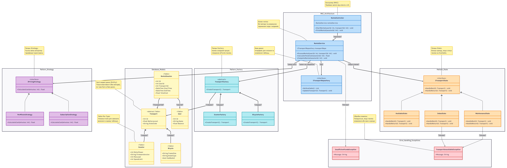

# UML-діаграма

# Посилання
https://mermaid.ai/app/projects/dab3a6f0-12e8-40e2-9baf-4fb870e16267/diagrams/bca356db-0a32-4dc5-b2e7-6a7bad1c16eb/version/v0.1/edit

# Код Сайта Mermaid
    classDiagram
    direction TB

    %% ==========================================
    %% 1. ВЕРХНІЙ РІВЕНЬ: MVC (Мозок)
    %% ==========================================
    namespace MVC_Architecture {
        class RentalController {
            -RentalService rentalService
            +StartRental(userId: int, transportId: int) void
            +FinishRental(sessionId: int) void
        }

        class RentalService {
            -ITransportRepository transportRepo
            +ProcessRental(userId: int, transportId: int) void
            +CalculateTotalCost(sessionId: int) float
            +CompleteRental(sessionId: int) void
        }

        class ITransportRepository {
            <<interface>>
            +GetAvailable() List
            +UpdateTransport(t: Transport) void
        }
    }

    %% ==========================================
    %% 2. СЕРЕДНІЙ РІВЕНЬ: Патерни логіки (Strategy та State)
    %% ==========================================
    namespace Pattern_Strategy {
        class IPricingStrategy {
            <<interface>>
            +CalculateCost(minutes: int) float
        }

        class PerMinuteStrategy {
            +CalculateCost(minutes: int) float
        }

        class SubscriptionStrategy {
            +CalculateCost(minutes: int) float
        }
    }

    namespace Pattern_State {
        class ITransportState {
            <<interface>>
            +HandleRent(t: Transport) void
            +HandleReturn(t: Transport) void
        }

        class AvailableState {
            +HandleRent(t: Transport) void
            +HandleReturn(t: Transport) void
        }

        class InUseState {
            +HandleRent(t: Transport) void
            +HandleReturn(t: Transport) void
        }
        
        class MaintenanceState {
            +HandleRent(t: Transport) void
            +HandleReturn(t: Transport) void
        }
    }

    %% ==========================================
    %% 3. НИЖНІЙ СЕРЕДНІЙ РІВЕНЬ: Фабрика
    %% ==========================================
    namespace Pattern_Factory {
        class TransportFactory {
            <<abstract>>
            +CreateTransport() Transport
        }
        
        class ScooterFactory {
            +CreateTransport() Transport
        }
        
        class BicycleFactory {
            +CreateTransport() Transport
        }
    }

    %% ==========================================
    %% 4. НИЖНІЙ РІВЕНЬ: База Даних (Таблиці)
    %% ==========================================
    namespace Database_Models {
        class Transport {
            <<abstract Table>>
            +int Id
            +float BatteryLevel
            +String StateCode
        }

        class Scooter {
            <<Table>>
            +int MotorPower
            +String FirmwareVersion
            +int MaxLoad
            +int SpeedLimit
        }

        class Bicycle {
            <<Table>>
            +String FrameSize
            +String BrakeType
            +bool HasBasket
        }

        class User {
            <<Table>>
            +int Id
            +String Name
            +float Balance
        }

        class RentalSession {
            <<Table>>
            +int Id
            +int UserId
            +int TransportId
            +DateTime StartTime
            +DateTime EndTime
            +float TotalCost
        }
    }

    %% ==========================================
    %% 5. БЛОК ПОМИЛОК (Збоку)
    %% ==========================================
    namespace Error_Handling_Exceptions {
        class InsufficientFundsException {
            +Message: String
        }
        class TransportUnavailableException {
            +Message: String
        }
    }

    %% ==========================================
    %% ЗВ'ЯЗКИ (Згруповані для правильної відмальовки)
    %% ==========================================
    
    %% Зв'язки Контролера та Сервісу
    RentalController --> RentalService : "викликає"
    RentalService --> IPricingStrategy : "рахує ціну"
    RentalService --> ITransportState : "керує станом"
    RentalService --> ITransportRepository : "БД"
    RentalService --> TransportFactory : "запит на створення"

    %% Реалізація Стратегії
    IPricingStrategy <|.. PerMinuteStrategy
    IPricingStrategy <|.. SubscriptionStrategy

    %% Реалізація Станів
    ITransportState <|.. AvailableState
    ITransportState <|.. InUseState
    ITransportState <|.. MaintenanceState
    
    %% Робота Фабрики
    TransportFactory <|-- ScooterFactory : "спадкує"
    TransportFactory <|-- BicycleFactory : "спадкує"
    TransportFactory --> Transport : "створює"
    
    %% Моделі Бази Даних
    Transport <|-- Scooter : "спадкує"
    Transport <|-- Bicycle : "спадкує"
    RentalSession --> User : "UserId"
    RentalSession --> Transport : "TransportId"

    %% Помилки (пунктиром)
    RentalService ..> InsufficientFundsException : "throws"
    InUseState ..> TransportUnavailableException : "throws"
    MaintenanceState ..> TransportUnavailableException : "throws"

    %% ==========================================
    %% НОТАТКИ ДО КЛАСІВ (З тегами   замість \n)
    %% ==========================================
    note for RentalController "Контролер (MVC): Приймає запити від клієнта з UI."
    note for RentalService "Бізнес-логіка: Всі методи та розрахунки перенесені сюди з моделей."
    note for ITransportRepository "База даних: Інтерфейс для читання та оновлення таблиць."
    
    note for IPricingStrategy "Патерн Strategy: Гнучка зміна алгоритму тарифікації користувача."
    note for ITransportState "Патерн State: Блокує оренду, якщо статус техніки не Available."
    note for TransportFactory "Патерн Factory: Ізолює складний процес створення об'єктів техніки."
    
    note for TransportUnavailableException "Обробка помилок: Генерується, якщо техніка зламалася або вже в оренді."

    note for Transport "Чисті моделі даних (Entity): Тільки властивості (без методів), як і має бути в базі даних."
    note for Scooter "Table-Per-Type: Унікальні поля для самоката винесені в окрему таблицю."

    %% ==========================================
    %% КОЛЬОРОВІ СТИЛІ
    %% ==========================================
    style RentalController fill:#bbdefb,stroke:#1976d2,stroke-width:2px
    style RentalService fill:#bbdefb,stroke:#1976d2,stroke-width:2px
    style ITransportRepository fill:#bbdefb,stroke:#1976d2,stroke-width:2px
    style IPricingStrategy fill:#e1bee7,stroke:#8e24aa,stroke-width:2px
    style PerMinuteStrategy fill:#e1bee7,stroke:#8e24aa,stroke-width:2px
    style SubscriptionStrategy fill:#e1bee7,stroke:#8e24aa,stroke-width:2px
    style ITransportState fill:#ffe0b2,stroke:#f57c00,stroke-width:2px
    style AvailableState fill:#ffe0b2,stroke:#f57c00,stroke-width:2px
    style InUseState fill:#ffe0b2,stroke:#f57c00,stroke-width:2px
    style MaintenanceState fill:#ffe0b2,stroke:#f57c00,stroke-width:2px
    style TransportFactory fill:#b2ebf2,stroke:#0097a7,stroke-width:2px
    style ScooterFactory fill:#b2ebf2,stroke:#0097a7,stroke-width:2px
    style BicycleFactory fill:#b2ebf2,stroke:#0097a7,stroke-width:2px
    style Transport fill:#fff9c4,stroke:#fbc02d,stroke-width:2px
    style Scooter fill:#fff9c4,stroke:#fbc02d,stroke-width:2px
    style Bicycle fill:#fff9c4,stroke:#fbc02d,stroke-width:2px
    style User fill:#fff9c4,stroke:#fbc02d,stroke-width:2px
    style RentalSession fill:#fff9c4,stroke:#fbc02d,stroke-width:2px
    style InsufficientFundsException fill:#ffcdd2,stroke:#c62828,stroke-width:2px
    style TransportUnavailableException fill:#ffcdd2,stroke:#c62828,stroke-width:2px